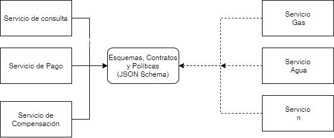

# Taller de modelación y validación de la arquitectura

## Justificación de arquitectura

## Patrones

## Ventajas y desventajas (Trade-offs)

A continuación, se describen las ventajas y desventajas de cada uno de los patrones utilizados en nuestra arquitectura:

**Intermediate routing**

  *Ventajas*
    - Permite la automatización de decisiones complejas y la rápida adaptación a cambios en los requisitos empresariales 
    - El motor de reglas de enrutamiento centralizado ayuda a aliviar el riesgo de introducción de posibles fallos
    - Pérdida de acomplamiento
    - Servicios reutilizables
    - Composición de servicios
    
  *Desventajas*
    - La modificación dinámica de las reglas de enrutamiento en tiempo de ejecución puede presentar el riesgo de que la lógica no probada previamente pase a producción
    - La lógica de enrutamiento agrega sobrecarga de rendimiento en comparación con la comunicación directa entre servicios
   
## Estilos de arquitectura

