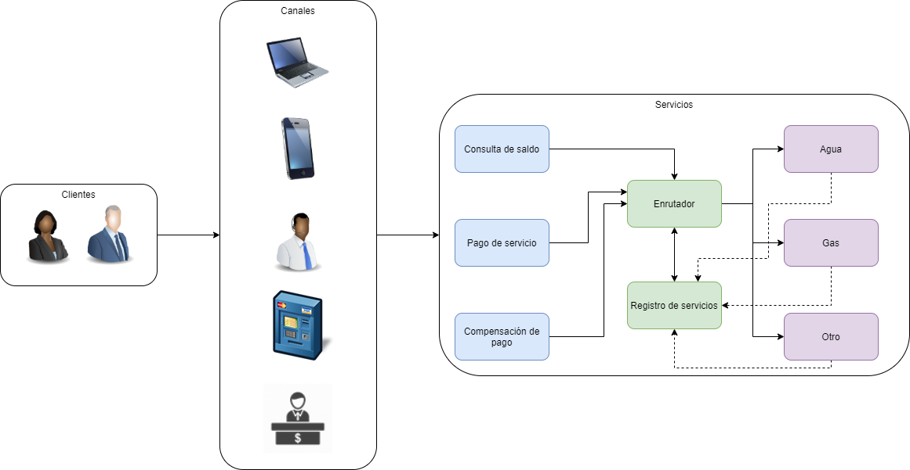

# Taller de modelación y validación de la arquitectura

## Justificación de arquitectura

La necesidad que tiene el banco ABC de poder interconectar varios proveedores 

## Patrones

Los patrones utilizados dentro de la arquitectura son los siguientes:

1. Intermediate Routing

2. Service Discovery
   - Service Registry
   - Client-Side Service Discovery

## Ventajas y desventajas (Trade-offs)

A continuación, se describen las ventajas y desventajas de cada uno de los patrones utilizados en nuestra arquitectura:

**Intermediate routing**

  *Ventajas*
    
    - Permite la automatización de decisiones complejas y la rápida adaptación a cambios en los requisitos empresariales 
    - El motor de reglas de enrutamiento centralizado ayuda a aliviar el riesgo de introducción de posibles fallos
    - Pérdida de acomplamiento
    - Servicios reutilizables
    - Composición de servicios
    
  *Desventajas*
  
    - La modificación dinámica de las reglas de enrutamiento en tiempo de ejecución puede presentar el riesgo de que la lógica no probada previamente pase a producción
    - La lógica de enrutamiento agrega sobrecarga de rendimiento en comparación con la comunicación directa entre servicios

**Client-side service discovery**

 *Ventajas*
 
    - Menor cantidad de saltos de red y de componentes móviles en comparación al patrón Server-Side
   
 *Desventajas*
 
    - Acomplamiento con el servicio de registro
    - Se requiere la implementación de una lógica para descubrimiento de servicios por cada lenguaje de programción/framweork utilizado 

**Service registry**

 *Ventajas*
 
    - El cliente del servicio y/o enrutadores pueden descubrir la ubicación de las instancias del servicio
    
 *Desventajas*
 
    - A menos de que el servicio de registro ya se encuentra incorporado en la infraesctructura actual, éste se convierte en un componente adicional que se debe configurar
    - El servicio de registro es un componente crítico dentro de la arquitectura, debe estar desplegado en un esquema de alta disponibilidad  
   
## Estilos de arquitectura

Servicios basados en frits-contract y utilizando el estandar RAML para la definición del contrato

